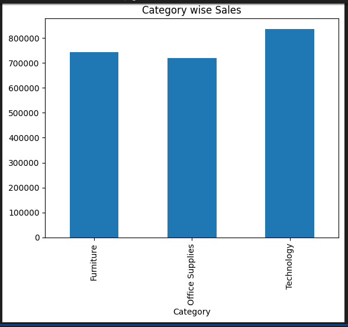
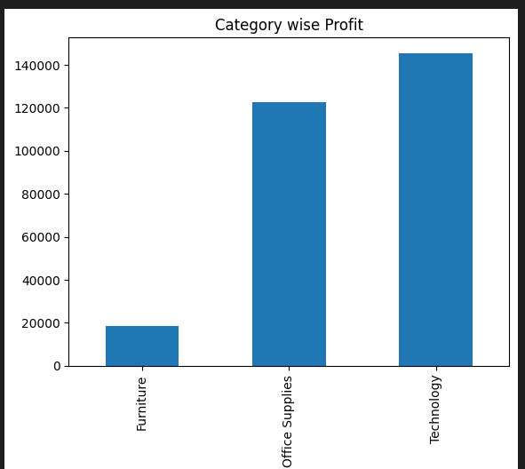
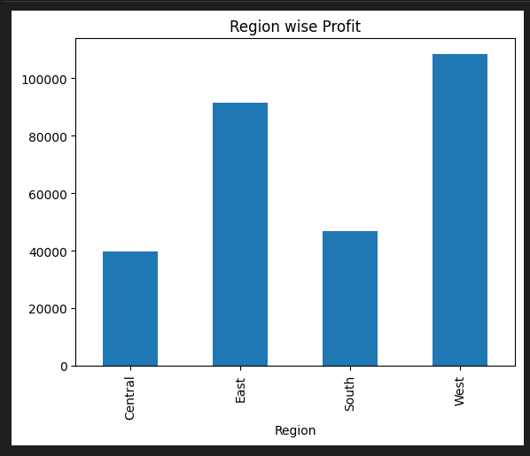
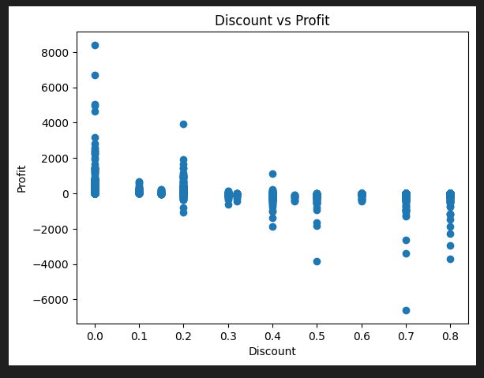

# Sales Data Analysis Project

## 📌 Project Overview
This project analyzes sales data using Python and Pandas.
The goal is to identify profit trends, top-performing regions, and loss-making products.

## 🛠 Tools Used
- Python
- Pandas
- Matplotlib
- Jupyter Notebook

## 📊 Key Insights
- Identified top profit generating regions
- Found products with highest losses
- Analyzed monthly sales trends

## 📂 Dataset
Sample Superstore Dataset

## 🚀 How to Run
1. Open the notebook in Jupyter
2. Run all cells
3. View visualizations and insights

## 📊 Project Visualizations

### 🏷 Category Wise Sales

### 💰 Category Wise Profit

### 🌍 Region Wise Profit

### 🎯 Discount vs Profit Analysis

